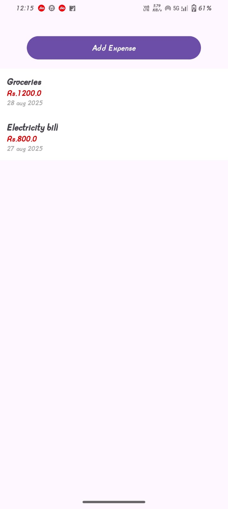
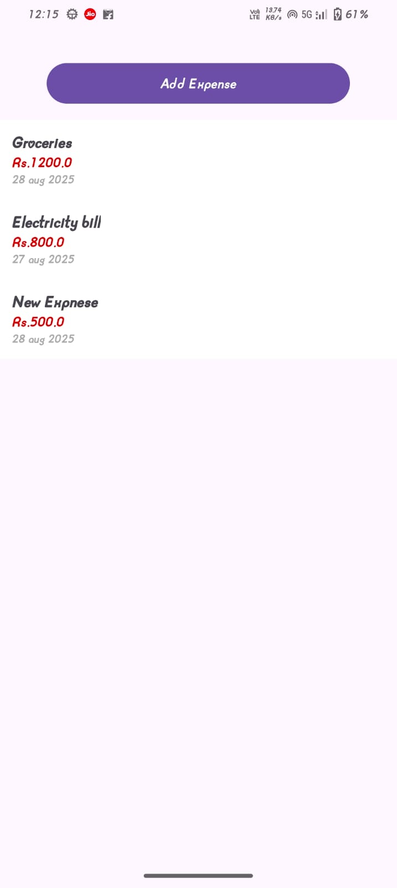

# 💰 ExpenseTracker App

A simple Expense Tracker App built in Android (Kotlin + XML) to practice RecyclerView with DiffUtil.

The app allows users to track expenses in a scrollable list, making use of DiffUtil for efficient list updates instead of manually refreshing the RecyclerView.

# 🚀 Features

Add expenses with details (title, amount, etc.)

Display expenses in a RecyclerView

Efficient list updates with DiffUtil

Clean separation of concerns using Adapter + DiffUtilCallback

Lightweight and beginner-friendly

# 🛠️ Tech Stack

Language: Kotlin

UI: XML Layouts

Core Android Concepts:

RecyclerView & ViewHolder

DiffUtil (ExpenseDiffUtilCallback)

Custom Adapter (ExpenseAdapter)

Data class (Expense)

# 📂 Project Structure

├── MainActivity.kt                  # Hosts RecyclerView

├── Expense.kt                       # Data class representing an expense

├── ExpenseAdapter.kt                # RecyclerView Adapter

├── ExpenseDiffUtilCallback.kt       # Handles efficient list updates

└── res/layout/                     
      ├── activity_main.xml          # Main layout
      
      └── item_expense.xml           # Layout for a single expense row
      

# 📸 Screenshots 

### SCREEN BEFORE DYNAMIC UPDATE

### SCREEN AFTER DYNAMIC UPDATE

	
# 📖 Learning Outcome

Through this project, I learned:

How to use RecyclerView with dynamic lists

The importance of DiffUtil for efficiently updating RecyclerView items

Writing a DiffUtil.Callback implementation (ExpenseDiffUtilCallback)

Implementing a clean Adapter + ViewHolder pattern

Better performance compared to notifyDataSetChanged()

# ⚡ How to Run

Clone this repository  https://github.com/suhaniranka006/Expense_List_App.git

Open in Android Studio

Run the app on an emulator or physical device

# 🙌 Future Improvements

Add database support (Room) to persist expenses

Filter expenses by date or category

Add charts to visualize expenses (using MPAndroidChart or Jetpack Compose)

Use MVVM + ViewModel for better architecture
